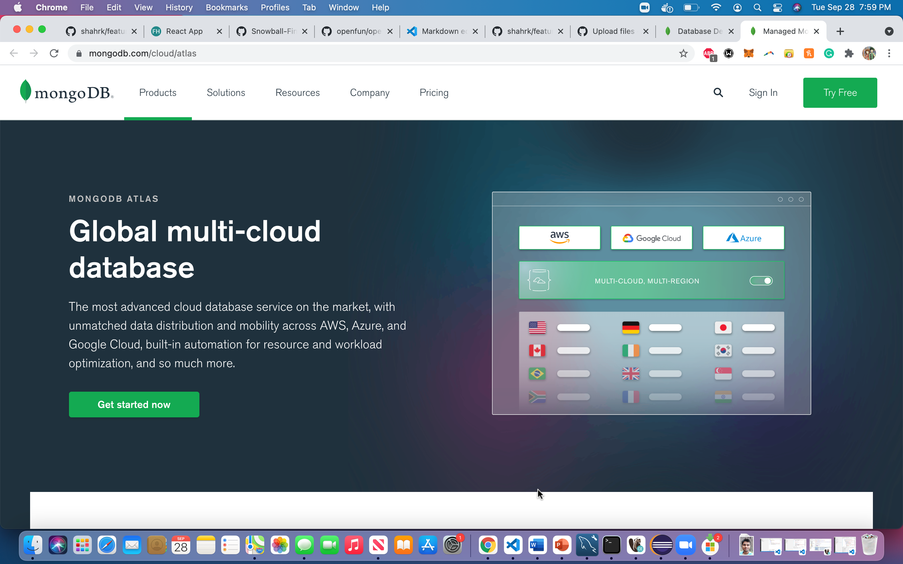
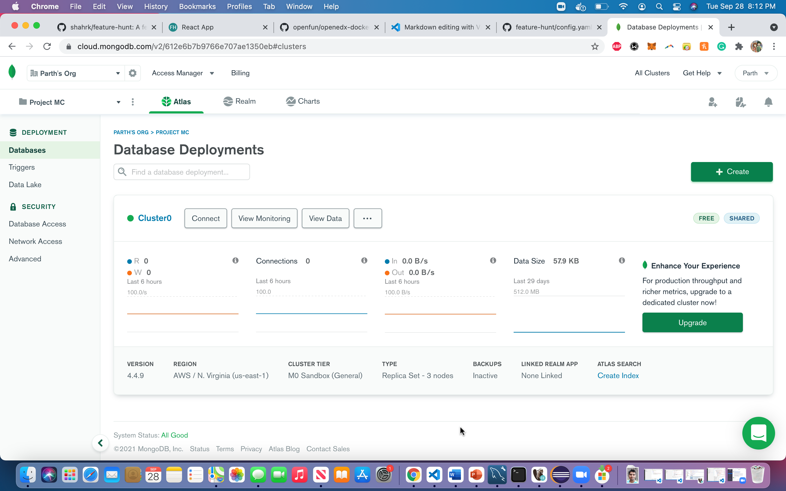
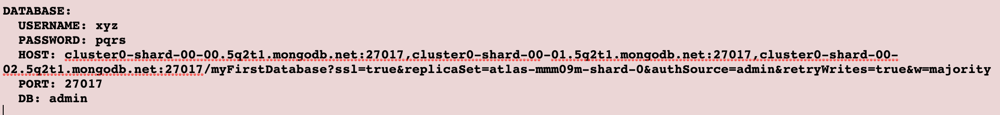

## INTRODUCTION ⚡️

Stop letting ideas slip through the cracks. Collect, analyze, and organize feedback and feature requests in your product's feedback board to make better product decisions.  
  
Feature Hunt is a platform that allows you to do just that. Users can share/vote/discuss feature requests and product owners can organize them to make better product decisions 🎯.

### Watch this short video to know more:

https://user-images.githubusercontent.com/26930183/134577498-bb9e7235-27b4-4855-a850-bea899d9e626.mp4

The following technologies were used for the development of this project:  

  
   
  
  
  
  

  

React (P.S. we use hooks)  
JavaScript  
Python3  
Flask  
MongoDB  
HTML  
CSS  

Although we haven't used any CSS library for the FrontEnd, the users can easily merge it with any CSS library of their choice (e.g. Tailwind CSS, react-bootstrap).

## Preview
The **Home** Page - It has a list of different products for which you can provide feature requests
  

The **Product** Page - It has a list of feature requests added by users
  

The **Comment** Section - Each product page has a comment section (Powered by [utteranc.es](https://utteranc.es))

## Add Your Project 

> Want to gather feedback and maintain your project's roadmap more efficiently?  

You can add your project to Feature Hunt by filling [this](http://tiny.cc/new-project) form, our team will review the response and add it to our database after doing our due diligence.

## Getting Started with Development
There are two ways to install and develop for featurehunt 

Method 1) Using Docker

Method 2) Using Local machine

## Installation With Docker.

#### STEP 1)  Follow the steps to install Docker for your OS
 https://docs.docker.com/get-docker

#### STEP 2) Git clone the Repository using 

`git clone https://github.com/shahrk/feature-hunt.git`

#### STEP 3) Run the following Commands

`cd feature-hunt`

`docker-compose up`

This will run two docker containers. The frontend will run on port 3000 and the backend will run on port 5000

## Installation in Local Machine without Docker.

### First Time Setup

#### STEP 1) Git clone the Repository using 

`git clone https://github.com/shahrk/feature-hunt.git`

#### STEP 2) Run the following Commands

`cd feature-hunt`

>Optional: In the project directory run `git config --local core.hooksPath hooks` to make sure you have access to the Git Hooks.
Run the following commands in order:

#### STEP 3) `npm install`

Installs the dependencies for the React App

#### STEP 4) `pip install -r api/requirements.txt`

Installs the requirements for the Flask API

#### STEP 5) `yarn start`

Runs the frontend React app in the development mode.\
Open [http://localhost:3000](http://localhost:3000) to view it in the browser.

The page will reload if you make edits.\
You will also see any lint errors in the console.

#### STEP 6) `yarn start-api`

Runs the backend flask API in development mode.\
The API runs on [http://localhost:5000](http://localhost:5000).

Requests made to [http://localhost:3000](http://localhost:3000) that don't exist on the react server are automatically forwarded to this API

## Connecting with a Database

> We use Mongo Cloud Atlas for our project as we find it very convenient. You may choose to use a local mongodb instance or run a docker container

#### STEP 1) Make an account on Mongo Cloud Atlas 

#### STEP 2) Make a Database and grab the credentials by clicking on connect
  

#### STEP 3) Make the corresponding changes in the config.yaml file located in api folder

 

> You can also connect to the database from your shell using [mongosh](https://docs.mongodb.com/mongodb-shell/)

## Other Available Scripts

### `yarn test`

Launches the test runner in the interactive watch mode.\
See the section about [running tests](https://facebook.github.io/create-react-app/docs/running-tests) for more information.

### `yarn build`

Builds the app for production to the `build` folder.\
It correctly bundles React in production mode and optimizes the build for the best performance.

The build is minified and the filenames include the hashes.\
Your app is ready to be deployed!

See the section about [deployment](https://facebook.github.io/create-react-app/docs/deployment) for more information.

## Deployment

This section has moved here: [https://facebook.github.io/create-react-app/docs/deployment](https://facebook.github.io/create-react-app/docs/deployment)

## Contributors 🎯

<table>
  <tr>
    <td align="center"><a href="https://github.com/shahrk/"> <b>Raj Shah</b></a></td>
    <td align="center"><a href="https://github.com/Nirav1929/"> <b>Nirav Patel</b></a> </td>
    <td align="center"><a href="https://github.com/Parth59/"> <b>Parth Kanakiya</b></a> </td>
    <td align="center"><a href="https://github.com/mithildave/"> <b>Mithil Dave</b></a> </td>
    <td align="center"><a href="https://www.github.com/BhargavJethwa"> <b>Bhargav Jethwa</b></a> </td>
  </tr>
</table>
